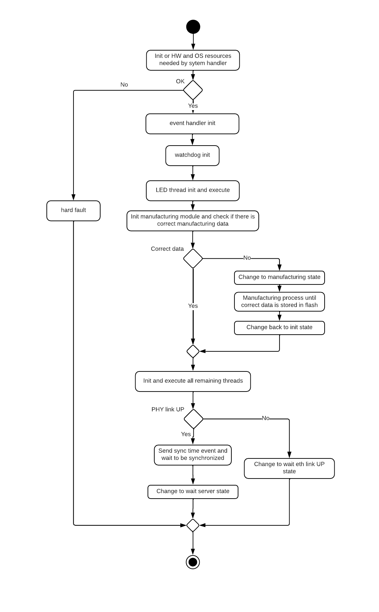
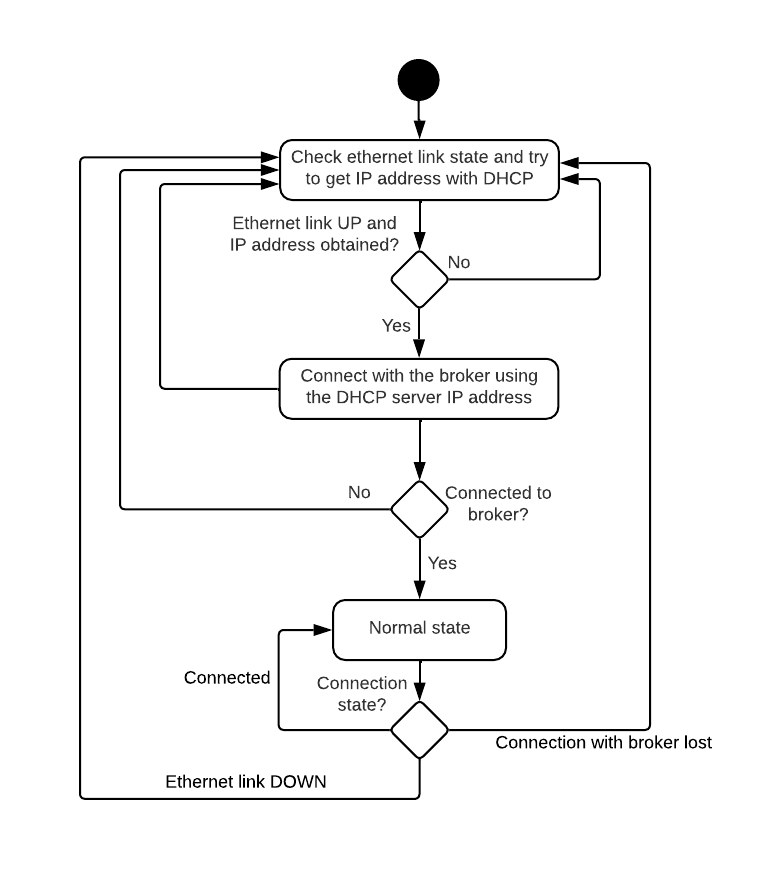
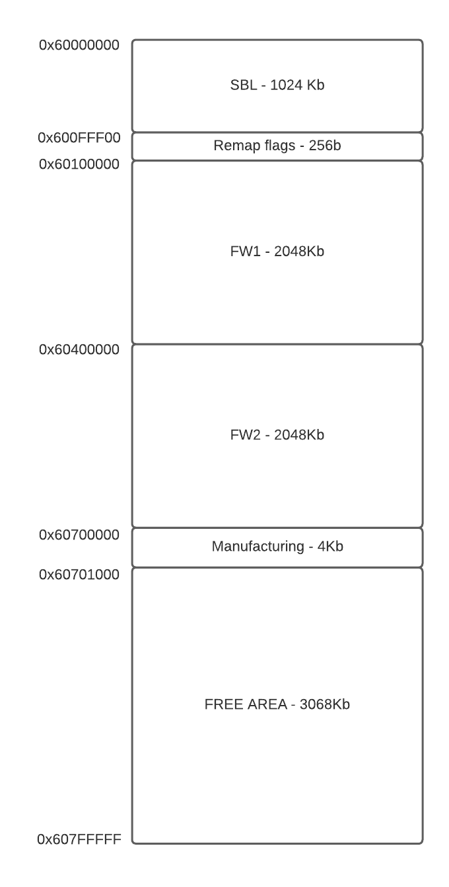

# ADE9000 Data Extractor

This repository contains the code for **ADE9000 Data Extractor**. This firmware is intended to run on the **i.MXRT1062** microcontroller.

It is a sensor that monitors electrical installations, using Analog Devices’ energy-metering IC, the **ADE90000**, as the system’s energy-measurement component. The ADE9000 Data Extractor firmware reads variables from the ADE90000 and sends them over Ethernet—either via **UDP** or **TCP**—to the computing node.

Two types of variables are read. We call these types **services**:
- fast variables (**raw**)
- slow variables (**registers**)

- **raw**: The sensor streams in real time the installation’s voltage, current, and power values. It can be configured to send all or only some of the fast variables. This configuration is done via MQTT.

- **registers**: There are multiple ADE90000 registers that can be read, either to monitor their values or to diagnose whether the ADE9000 Data Extractor sensor is correctly connected. They are read from the ADE90000 and sent to the computing node every 1.5 seconds. As with the raw variables, this configuration is done via MQTT. (See the internal document **Slow_Vars.pdf** for details.)

The **MQTT** protocol is documented in the **sensor-api** repository (internal).

## How to build and flash the code

This code was implemented with **MCUXpresso IDE v11.9.1**, so it is recommended to use the same version to import and build the project.

To import the project, right-click inside **Project Explorer** in MCUXpresso and select **“Import…”**. With **“Existing project into workspace”** checked, click **Next**.

Then, in **“Select root directory:”**, select the folder **“mcuxpresso/energy/ADSN”**. MCUXpresso should detect the project; make sure the project checkbox is selected and click **Finish** to complete the import.

This project has three build profiles configured. To select one, open the project properties and under **“C/C++ Build”** choose **“Manage Configurations…”**, then activate the desired configuration.

The profiles are:

### EVKB Debug

This profile was used during development with the **i.MXRT1062** evaluation board. It is used less often now that **ADSN** boards are available, but it is still useful for certain tests.

It works the same as the other profiles, except the pins are adapted to the **EVKB** hardware.

When building, only the **.axf** file required for debugging is generated. You only need to click **Debug** to flash and debug.

### ADSN Debug

This profile is also used for development, but directly on **ADSN4** hardware. In this case, the pins match those used on the **ADSN4**.

This profile is intended for debugging, so in the memory configuration the firmware is set to start at the initial execution address, and not after the **SBL** (bootloader).

When building, only the **.axf** file required for debugging is generated. You only need to click **Debug** to flash and debug.

### ADSN

This profile is implemented as the **release** version of **ADE9000 Data Extractor**.

In this case, two binaries are generated:

- A binary that includes the energy firmware and the bootloader.
- A binary that includes only the energy firmware.

The binary including the bootloader is generated using the **SBL git submodule**, and is built with the following post-build command (it first copies the required files from the Energy project so that SBL and Energy initializations are identical):

```bash
scons -C "${ProjDirTopLevel}/adsn_sbl/target/evkmimxrt1060/"
```

The **SBL** is built with a signature. To ensure the Energy firmware uses the same signature, run:

```bash
python3 "${ProjDirPath}/source/sbl/scripts/imgtool.py" sign --key "${ProjDirPath}/source/sbl/scripts/xxxx_priv.pem" --align 4 --version "1.1.0" --header-size 0x400 --pad-header --slot-size 0x200000 --max-sectors 32 "${BuildArtifactFileBaseName}.bin" "${ProjDirTopLevel}/bin/ADSN_energy_freerun.bin"
```

The file **xxxx_priv.pem** must be the same one used when building the **SBL**.

Once the firmware is generated, multiple commands are used to merge the two binaries into a single image and to place both the SBL+FW binary and the FW-only binary into the generated **bin** folder.

The bootloader binary is normally **only programmed the first time** a sensor is flashed. To do this, use the **GUI Flash Tool** included in **MCUXpresso**, select the binary, and ensure the flash start address is **0x60000000**, then program the microcontroller.

The FW-only binary is used to **update sensors from the AICT**. To update, go to the sensor’s **system** section in the AICT, click **Upload firmware**, and select the binary. If everything is correct, the sensor will update successfully.

## Firmware architecture

The firmware architecture is represented in the following image.


The items shown in gray are external elements—i.e., external modules that our system uses, but which are not code implemented specifically for **ADE9000 Data Extractor**, such as the operating system or microcontroller drivers.

Everything inside the blue box is code implemented for this project. This contains all sensor logic and functionality. It was designed to be independent from external modules so that if something external changes (for example, replacing the OS), it should not affect the application code—or, at worst, it would only affect a small part outside the **“platform independent”** box.

The idea is that the **APP** always calls functions from the **portability layer**, which will in turn call the operating system and the appropriate drivers. It relies on configuration files, which are the only parts affected if an external module changes.

## Folder structure

The folder structure was built to follow the firmware architecture:

- **doc**: Documentation files.
- **energy_freerun**: All **ADE9000 Data Extractor** functionality.
- **mcuxpresso**: Files required for the **MCUXpresso** project and project-specific code.
- **portability_layer**: The portability layer.
- **platform**: Operating system, drivers, and any external modules used by the project.
- **scripts**: Build scripts.

## `energy_freerun`

This folder contains the **Energy Freerun** logic. The code in this folder should be independent of the operating system, microcontroller, and hardware.

At the top level is the system core, which contains the system intelligence and everything needed to integrate the different modules and threads.

Each subfolder is a thread or module used by ADE9000 Data Extractor, but in theory they could work on any other device that requires the same functionality. The top level also includes everything needed to configure the threads/modules used and to manage the different **ADE9000 Data Extractor** states.

## System handler

The **system_handler** is responsible for the device behavior. It initializes everything required in the system and changes state based on events that occur during firmware execution. It also manages communication with each thread/module when needed.

The states are represented in the following diagram:


Most states have fairly simple logic and transition from one to another depending on the received event.

The exception is the **initialization state**, where the configuration of all required components is performed and multiple conditions are verified before moving to the next state.



Once initialized, if there is an Ethernet link and the system connects to an MQTT server, it will transition to the normal state, where it keeps most of its functionality. It will only leave this state in the following cases:

- **Ethernet link loss**: If the Ethernet link is lost, the system transitions to **“wait eth link”** and remains there until the link is detected again. When this happens, it transitions to **“wait server”**, where it waits to reconnect to the MQTT broker. Once the connection is established, it returns to the normal state.
- **Broker disconnection**: If the connection to the MQTT broker is lost, the system transitions to **“wait server”** and remains there until it can reconnect. Once connected, it returns to the normal state.



- **Receive FW update command**: If it receives an MQTT command containing an update file, the system transitions to the **“FW update”** state. In this state, all services stop and the system focuses on writing the received file to flash. Once the write completes successfully, the system restarts. If the image is not written correctly, the written data is erased and the system returns to the **normal** state after sending an alert, or transitions to the **error** state if the cause is a system failure.
- **Error**: If an error is detected that can affect correct system operation, it transitions to the **“error state”** and remains there until it is restarted or updated.

### Event handler

Module responsible for evaluating every alert that occurs in the system. It collects alert information and determines its level: **info**, **warning**, or **error**.

It provides an interface so that any module can notify the system when an alert occurs. When a module uses this interface, it will send an alert event to the system and push the alert information into a queue. Normally, it is used through **interfaces.h**.

When this event is sent, the system processes it using the event handler, which evaluates the alert and returns to the **system handler** the information needed to send it to the server. This includes whether it is **info**, **warning**, or **error**, the error code, its description, and the domain where it occurred (system, sensor, or service).

If the alert is an **error**, the system transitions to the error state and notifies the server. In this case, the **event handler** keeps a **history of up to 10 errors**, allowing the server to receive a record of errors that occurred.

These are the possible alert types:

| System error codes | Description | Type |
|:---|:---|:---|
| 1 | Error code not specified trying to notify an alert. | Error |
| 2 | Alert level not specified. | Error |
| 3 | Invalid domain specified trying to give an alert. | Warning |
| 4 | Watchdog reset detected on system startup. | Warning |
| 5 | Too much time without IRQ, energy sensor will be reconfigured and restarted. | Warning |
| 6 | ADE90000 reconfiguration error. | Error |
| 7 | ADE90000 register read error. | Error |
| 8 | ADE90000 register write error. | Error |
| 9 | ADE90000 burst error. | Error |
| 10 | ADE90000 too much time between waveform data reads detected, possible data lost. | Warning |
| 11 | ADE90000 too much time between registers reads detected, possible data lost. | Warning |
| 12 | Time synchronized timeout. System time not updated. | Warning |
| 13 | FW update done. | Info |
| 14 | No FW update detected. | Info |
| 15 | Flash erase operation failed while FW update. | Error |
| 16 | Flash writing operation failed while FW update. | Error |
| 17 | Flash partition boundary exceeded while FW update. | Warning |
| 18 | Error sending discovery. | Error |
| 19 | Error sending status. | Error |
| 20 | Received mqtt command is unknown or has an incorrect payload data. | Warning |
| 21 | ADE90000 reset configuration command cannot be used when the sensor is not configured. | Warning |
| 22 | Start command cannot be used when the sensor is not configured. | Warning |
| 23 | Stop command cannot be used when the sensor is not configured. | Warning |
| 24 | Complete update received without going to fw update state. | Error |
| 25 | ADE90000 has been reconfigured. | Info |
| 26 | Error getting mqtt command. | Error |
| 27 | Received fundamental frequency is invalid. It should be 50 or 60 Hz. | Warning |
| 28 | Value was not written in register. Make sure that the ADE90000 is correctly connected. | Warning |
| 29 | Received hw config is invalid. | Warning |
| 30 | Received TC values are invalid. Make sure that configured TC values are not 0. | Warning |
| 31 | ADE90000 irq not working. | Error |
| 32 | Configured protocol is unknown or not supported. | Warning |
| 33 | Configured format is unknown or not supported. | Warning |
| 34 | UDP data could not be sent. | Warning |
| 35 | UDP data sending error. | Error |
| 36 | FW update interrupted due to a disconnection. Try again. | Warning |
| 37 | Update area not empty. New FW could not be written. | Warning |
| 38 | FW update interrupted, new fw was not compatible or corrupted. Memory erased, try again. | Warning |
| 39 | New fw has incompatible magic number. Update not done. | Warning |
| 40 | New fw has incompatible header size. Update not done. | Warning |
| 41 | New fw written size and the specified in header are not equal. Corrupted image, update not done. | Warning |
| 42 | New fw is not compatible with the version of the bootloader in use. Update not done. | Warning |
| 43 | TCP data could not be sent. | Warning |
| 44 | TCP data sending error. | Warning |
| 45 | Fast queue full. Data lost! | Warning |
| 46 | Slow queue full. Data lost! | Warning |
| 47 | Queue data could not be obtained. | Warning |
| 48 | Fast vars could not start. | Warning |
| 49 | Slow vars could not start. | Warning |
| 50 | Could not connect with TCP server. | Warning |
| 51 | Could not reconnect with TCP server, make sure there is a source. | Warning |
| 52 | MQTT reception buffer is full, command may have been lost. | Warning |
| 53 | Service already running. | Info |
| 54 | Service already stopped. | Info |
| 55 | Power on reset detected on system startup. | Info |
| 56 | Security reset detected on system startup. | Warning |
| 57 | Software reset detected on system startup. | Info |
| 58 | JTAG hardware reset detected on system startup. | Info |
| 59 | JTAG software reset detected on system startup. | Info |
| 60 | Temperature sensor reset detected on system startup. | Warning |
| 61 | Time synchronized with server. | Info |
| 62 | Incorrect manufacturing data received. New data not stored in flash. | Warning |
| 63 | Incorrect ID number format, it should be X-XXXXXX. | Warning |
| 64 | Incorrect MAC number format, it should be XX:XX:XX:XX:XX:XX. | Warning |
| 65 | Incorrect sensor model read in memory. | Warning |
| 66 | Sensor model not read in memory manufacturing information. | Warning |
| 67 | Sensor hw board not read in memory manufacturing information. | Warning |
| 68 | Sensor hw serial number not read in memory manufacturing information. | Warning |
| 69 | Sensor hw manufacturer not read in memory manufacturing information. | Warning |
| 70 | Sensor hw version not read in memory manufacturing information. | Warning |
| 71 | Introduced service communication data format is unknown or not compatible. | Warning |
| 72 | Introduced communication protocol is unknown or not compatible. | Warning |
| 73 | Trying to read sensor data, with no protocol defined. | Error |
| 74 | Time sync process never finished, make sure that the module in charge is well configured. | Error |
| 75 | Too much time erasing new FW area. | Error |
| 76 | No available state change data to change to online state. | Error |
| 77 | Error getting the JSON to send an alert mqtt message. | Error |
| 78 | Error getting the JSON to send a timestamp mqtt message. | Error |
| 79 | Error getting the JSON to send an info message. | Error |
| 80 | Error getting the JSON to send sensor status message. | Error |
| 81 | Error getting the JSON to send sensor status message. | Error |
| 82 | Error getting the JSON to send service status message. | Error |
| 83 | Obtained sensor service is invalid. | Error |
| 84 | Unknown slow register type to read. | Error |
| 85 | Missing fundamental frequency configuration. | Error |
| 86 | Missing tc primary and secondary configuration. | Error |
| 87 | Time synchronization type is unknown, no synchronization done. | Warning |
| 88 | Service vars configuration is incorrect. Service not started. | Warning |
| 89 | No slot number detected, assumed that FW is running in slot number one. | Warning |
| 90 | No correct variable configuration received in service start command. | Warning |
| 91 | No correct transmission configuration received in service start command. | Warning |
| 92 | One of the received registers is not configurable in this service. | Warning |
| 93 | Some of the registers could not be read. Registers service data not sent. | Warning |
| 94 | Incorrect IP configured. Make sure configured IP is not localhost or the IP of the remote sensor. | Warning |
| 95 | FW UPDATE FAILURE! New FW was successfully written, but SBL did not make the update, please try again. | Warning |
| 96 | FW UPDATE FAILURE! System was restarted without correctly writing the new FW, please try again. | Warning |
| 97 | Hardfault generic error reset detected. | Warning |
| 98 | Non-Maskable Interrupt Hardfault error reset detected. | Warning |
| 99 | Memory Management Hardfault error reset detected. | Warning |
| 100 | Bus Hardfault error reset detected. | Warning |
| 101 | Usage Hardfault error reset detected. | Warning |
| 102 | Supervisor Call (SVC) Hardfault error reset detected. | Warning |
| 103 | Debug monitoring Hardfault error reset detected. | Warning |
| 104 | Pending service Hardfault error reset detected. | Warning |
| 105 | System tick Hardfault error reset detected. | Warning |
| 106 | Interruption handler Hardfault error reset detected. | Warning |
| 107 | Stack overflow Hardfault error reset detected. | Warning |
| 108 | Malloc Hardfault error reset detected. | Warning |
| 109 | Assert Hardfault error reset detected. | Warning |
| 110 | Thread creation Hardfault error reset detected. | Warning |
| 111 | Thread initialization Hardfault error reset detected. | Warning |
| 112 | Thread not initialized Hardfault error reset detected. | Warning |
| 113 | Watchdog initialization Hardfault error reset detected. | Warning |
| 114 | Watchdog not initialized Hardfault error reset detected. | Warning |
| 115 | Manufacturing module not initialized Hardfault error reset detected. | Warning |
| 116 | Debug shell not initialized Hardfault error reset detected. | Warning |
| 117 | Unknown switch case Hardfault error reset detected. | Warning |
| 118 | Queue creation Hardfault error reset detected. | Warning |
| 119 | Event creation Hardfault error reset detected. | Warning |
| 120 | Unknown event Hardfault error reset detected. | Warning |
| 121 | Lazy stacking of the MPU Hardfault error reset detected. | Warning |
| 122 | Heap push Hardfault error reset detected. | Warning |
| 123 | Heap unstack Hardfault error reset detected. | Warning |
| 124 | Data access violation Hardfault error reset detected. | Warning |
| 125 | Instruction access violation Hardfault error reset detected. | Warning |
| 126 | Bus lazy stacking Hardfault error reset detected. | Warning |
| 127 | Bus heap stacking Hardfault error reset detected. | Warning |
| 128 | Bus heap unstacking Hardfault error reset detected. | Warning |
| 129 | Imprecise data bus Hardfault error reset detected. | Warning |
| 130 | Precise data bus Hardfault error reset detected. | Warning |
| 131 | Instruction bus Hardfault error reset detected. | Warning |
| 132 | Divided by zero usage Hardfault error reset detected. | Warning |
| 133 | Unaligned access usage Hardfault error reset detected. | Warning |
| 134 | No supported coprocessor instruction usage Hardfault error reset detected. | Warning |
| 135 | Invalid PC load usage Hardfault error reset detected. | Warning |
| 136 | Invalid state usage Hardfault error reset detected. | Warning |
| 137 | Undefined instruction usage Hardfault error reset detected. | Warning |
| 138 | Reading the registers took longer than expected. | Info |
| 139 | With the selected period and variable amount, the estimated time needed to read the registers exceeds the period time. There might be data losses. | Warning |
| 140 | With the selected period and variable amount, if raw service is also active, the estimated time needed to read the registers exceeds the period time. There might be data losses. | Warning |
| 141 | Received sensor configuration mqtt command has incorrect payload. | Warning |
| 142 | Received service start mqtt command has incorrect payload. | Warning |
| 142 | Received synchronization mqtt command has incorrect payload. | Warning |
| 144 | Received manufacturing mqtt command has incorrect payload. | Warning |

### Threads and modules

During initialization, the **system handler** passes the pointer to the global state to each thread, so that each thread can behave differently in each state, depending on how it is configured. Each thread is configured by the system handler, and the configuration of each thread/module is explained in the specific documentation found in its folder.

Energy thread: Thread that configures and handles ADE90000 interrupts. Depending on which ADE90000 services are active (fast variables “RAW” or slow variables “registers”), it sends the necessary events so that the variable-reading threads run after each interrupt.

Vars reading: Thread responsible for reading sensor variables (i.e., from the ADE90000) and sending data to the streaming thread. There is one instance per system service: one for fast variables and another for slow variables.

Commands thread: Thread that sends, receives, and parses MQTT commands.

It uses the communication protocol implemented inside the **protocol** folder.

FW update: Thread responsible for updating the system to another version. **SBL** (Secure BootLoader) version 1.1.0 is used as the bootloader. It typically works as SFW, but it cannot receive the new firmware via MQTT, so a modified version (**sfw_handling**) is used.

https://www.nxp.com/docs/en/application-note/AN13460.pdf

The flash memory is divided into several sectors:
- **Bootloader**: Contains the SBL and the firmware entry point. It reads the flags area (located just before FW1) and jumps to the FW area indicated in the header, as long as the firmware has the correct signature and no write errors.
- **FW1**: First firmware slot. When the firmware is not executing from here, this is the area used to write the new firmware.
- **FW2**: Second firmware slot. When the firmware is not executing from here, this is the area used to write the new firmware.
- **Manufacturing**: Area where manufacturing information is stored.



Led handler: Thread responsible for blinking the LED with the pattern configured for each system state. LED configuration:

- Init state: Continuous blink, 300 ms on and 300 ms off.
- Manufacturing state: Every 3 seconds the LED blinks 4 times.
- Ethernet link wait: Every 2 seconds the LED blinks 2 times.
- Server connection wait: Every 3 seconds the LED blinks 3 times.
- Normal state: Continuous blink, 1 s on and 1 s off.
- Error state: Fast continuous blink, 50 ms on and 50 ms off.
- FW update: Continuous blink, 300 ms on and 700 ms off (due to flash writes, on/off times may become longer).

Streaming: Thread responsible for sending via UDP the data obtained from the ADE90000. There is one instance per system service: one for fast variables and another for slow variables.

Timesync: Thread that synchronizes the system clock via NTP.

Watchdog: Module responsible for the system watchdog.

## Abstraction layer

This is the firmware’s abstraction layer. The **ADE9000 Data Extractor** firmware should not require any changes if the operating system or microcontroller changes, as long as everything required for the new platform is implemented in th abstraction layer. If not, the missing parts must be implemented in abstraction layer, but the firmware should remain unchanged.

The only project-dependent parts that would change are the abstraction layer configuration files: **absl_config.h** and **absl_hw_config.c/h**.

