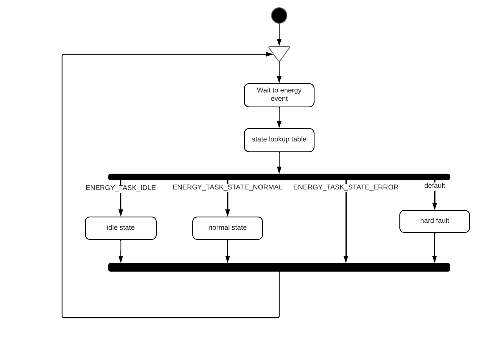
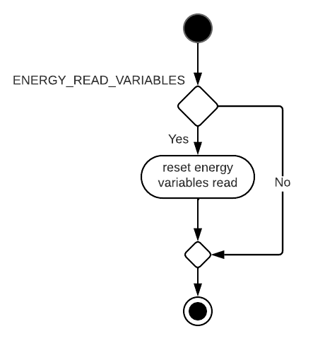
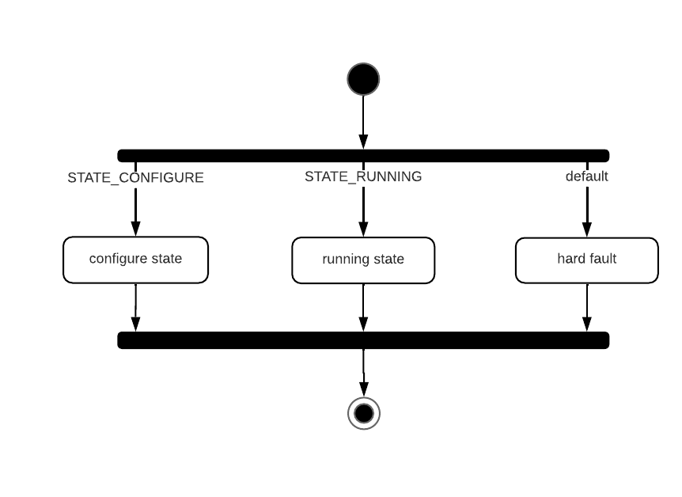
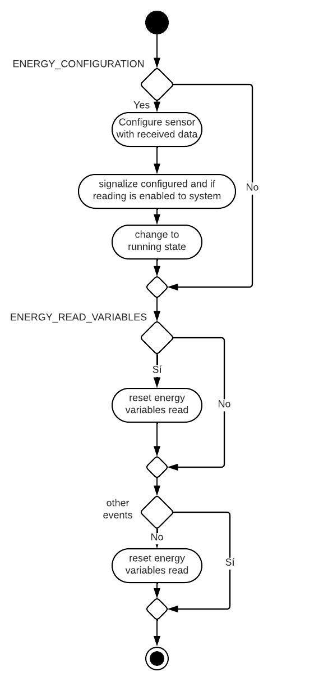
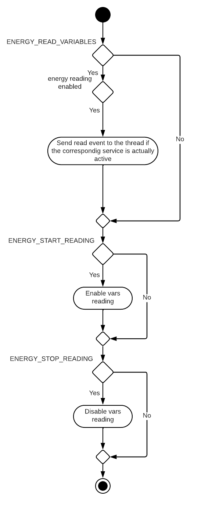

# Energy

 Hilo encargado de manejar y obtener la información necesaria del sensor. Se pretende que este hilo sea independiente del sensor, por lo que el codigo relacionado con el sensor de energy esta fuera de los ficheros del hilo, y accede a el a traves de interfaces.h.

 De la misma manera el hilo notifica eventos y obtiene la configuración del sensor y de los servicios del sensor a traves de interfaces.h. Desconoce cuales son los modulos encargados de esas tareas, ya que podrian variar en el tiempo o ser distintos en distinto dispositivos.

   

## Configuración del hilo energy

El hilo energy es configurado utilizando al siguiente estructura:

~~~
typedef struct energy_thread_config
{
	energy_sensor_init_conf_t 	energy_sensor_conf;
	absl_event_t*					system_events;
	uint32_t					configured_event;
	uint32_t					reconfig_event;
	uint32_t					wf_running;
	uint32_t					wf_stopped;
	uint32_t					reg_running;
	uint32_t					reg_stopped;
	absl_event_t*			 		energy_events;
	absl_event_t*			 		fast_vars_events;
	absl_event_t*			 		slow_vars_events;
	uint32_t					vars_config;
	uint32_t					vars_read;
	absl_queue_t*			 		fast_vars_tx;
	absl_queue_t*			 		slow_vars_tx;
	absl_event_t*			 		fast_vars_stream_events;
	absl_event_t*			 		slow_vars_stream_events;
	uint32_t					stream_connect;
	uint32_t					stream_disconnect;
	uint32_t			 		sensor_label;
	uint32_t			 		slow_vars_service_label;
	uint32_t			 		wvf_service_label;
	uint32_t			 		time_between_vars_read_events_ms;
	energy_task_states_t*		sensor_to_task_state;
	event_info_t* 				event_info_array;
	bool				 		energy_initialized;
}energy_thread_config_t;

~~~

- **energy_sensor_conf**: Variable que le pasa el hilo energy al modulo del sensor con su configuración especifica. El hilo energy desconoce el contenido de esta estructura ya que es especifico del sensor que se este utilizando.
  
  En la documentacion de los [sensores](../sensors/README.md) se explica el contenido de esta estructura.

- **system_events**: Grupo de eventos utilizado para mandar eventos al sistema.
- **configured_event**: Evento que indica al sistema que energy ha sido configurado.
- **reconfig_event**: Evento que indica al sistema que energy va a ser reconfigurado.
- **wf_running**: Evento que indica al sistema que el servicio raw está ejecutandose.
- **wf_stopped**: Evento que indica al sistema que el servicio está ha parado.
- **reg_running**: Evento que indica al sistema que el servicio registers está ejecutandose.
- **reg_stopped**: Evento que indica al sistema que el servicio registers está parado.
- **energy_events**: Grupo de eventos al que espera el hilo para ejecutarse.
- **fast_vars_events**: Grupo de eventos para mandar eventos al hilo encargado de leer las variables rapidas.
- **slow_vars_events**: Grupo de eventos para mandar eventos al hilo encargado de leer las variables lentas.
- **vars_config**: Evento para indicar al hilo de lectura de variables que tiene una nueva configuración disponible.
- **vars_read**: Evento para indicar al hilo de lectura de variables que lea las variables.
- **fast_vars_tx**: Queue para mandar la configuración de transferencia de las variables rapidas al hilo de streaming. 
- **slow_vars_tx**: Queue para mandar la configuración de transferencia de las variables lentas al hilo de streaming. 
- **fast_vars_stream_events**: Grupo de eventos para mandar eventos al hilo de streming de variables rapidas.
- **slow_vars_stream_events**: Grupo de eventos para mandar eventos al hilo de streming de variables lentas.
- **stream_connect**: Evento para que el hilo de streaming se conecte al servidor.
- **stream_disconnect**: Evento para que el hilo de streaming se desconecte del servidor.
- **sensor_label**: Etiqueta utilizada para identificar el sensor.
- **slow_vars_service_label**: Etiqueta utilizada para identificar el servicio de las variables lentas.
- **wvf_service_label**: Etiqueta utilizada para identificar el servicio del waveform o las variables rapidas.
- **time_between_vars_read_events_ms**: Tiempo que transcurre entre dos irq del sensor.
- **sensor_to_task_state**: Tabla que relaciona cada estado del sistema con uno de los estados del hilo.
- **event_info_array**: Array con las alertas y errores del hilo.
- **energy_initialized**: Inicializarlo siempre a false. Indica si el hilo ha sido inicializado correctamente o no. De esta forma el hilo se ira a error en caso de ejecutarlo antes de inicializarlo.

## Estados del hilo energy

El hilo espera ha eventos para ejecutarse y dependiendo del estado en el que este el sistema, el hilo energy se ejecutara en un estado, y hara lo necesario dependiendo del evento:

  

- **ENERGY_TASK_IDLE**: El hilo no hace nada, solo atiende a eventos de lectura de variables de energia en el caso de que ocurran, para resetar lo necesario y poder empezar a leer correctamente cuando sea necesario.
  
    

- **ENERGY_TASK_STATE_NORMAL**: El estado normal se divide en dos subestados ENERGY_TASK_NORMAL_STATE_CONFIGURE y ENERGY_TASK_NORMAL_STATE_RUNNING. 

 
  
  Si el sensor necesita configurarse se mantendra en este estado hasta que le llege el evento de configuración con los datos para ello. Una vez configurado pasara a  ENERGY_TASK_NORMAL_STATE_RUNNING hasta que le llegue un evento de reconfiguracion o el sistema se reinicie.
  
 

  En el subestado running, atendera a los eventos de emepzar la lectura, parar lectura y los eventos de irq del ADE9000.

   
  
- **ENERGY_TASK_STATE_ERROR**: En estado de error, el hilo no hace absolutamente nada.

