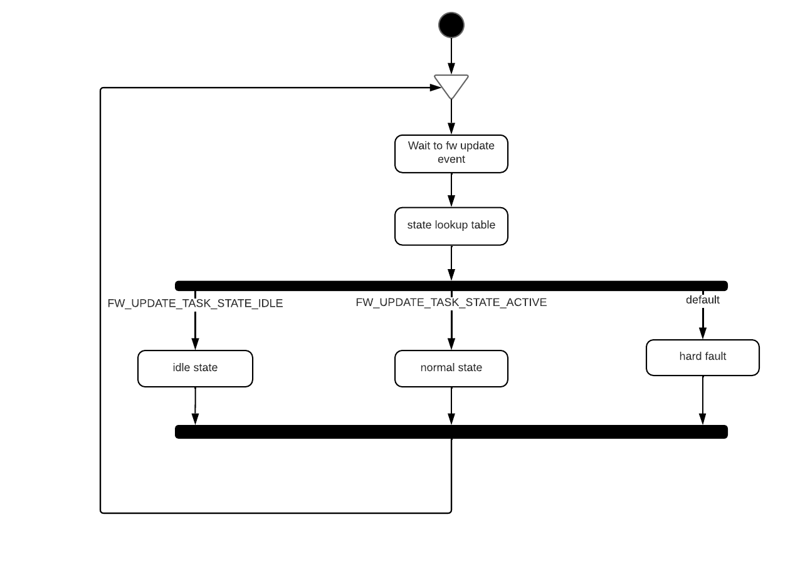
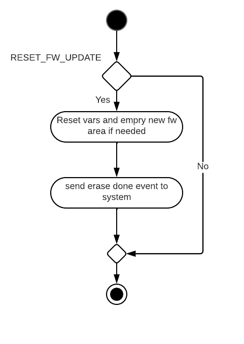
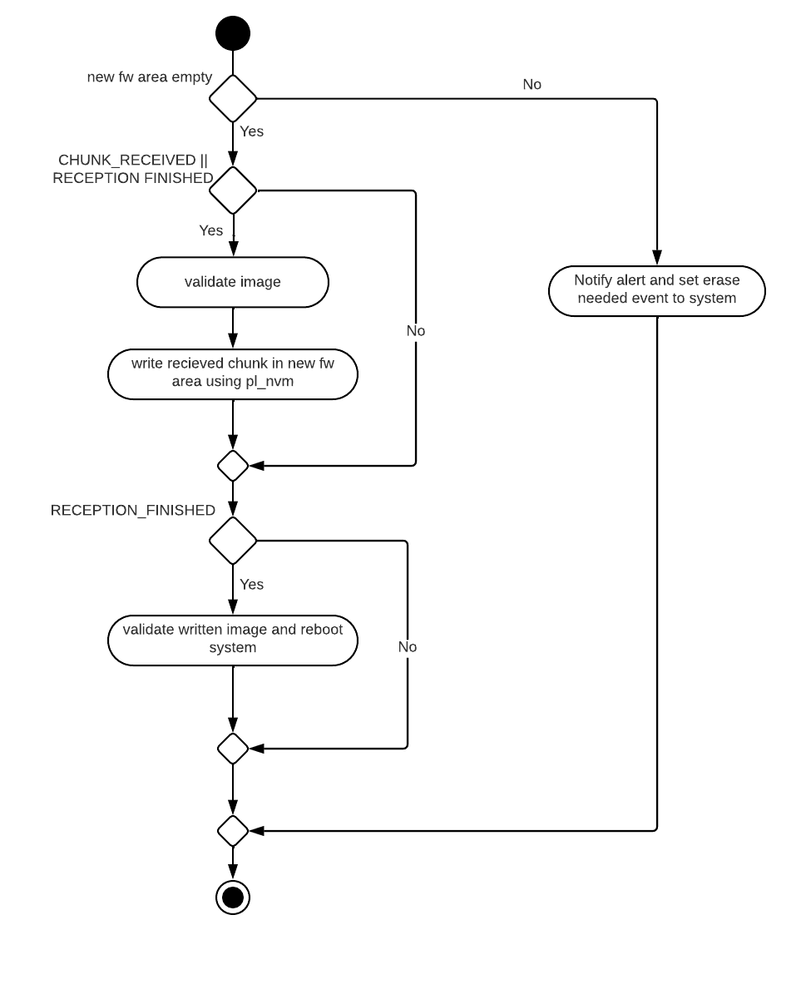

# Firmware update

 Hilo encargado de recivir y guardar en flash la siguiente versión de FW. El hilo desconoce como se verifica la imagen ni de que partes se compone, utiliza un modulo externo para ello que conoce estos detalles y los verifica. Este modulo podria ser distinto si este hilo se utiliza en distintos dispositivos o puede que cambie en futuras versiones, por lo que accede a traves de interfaces.h. De la misma manera el hilo notifica eventos. Desconoce cuales son los modulos encargados de esas tareas, ya que podrian variar en el tiempo o ser distintos en distinto dispositivos.

   

El hilo es configurado utilizando al siguiente estructura:

~~~
typedef struct fw_update_thread_config
{
	uint8_t 						nvm_conf_index;
	fw_update_handling_conf_t		fw_update_handling_conf;
	absl_event_t* 					fw_update_event_group;
	fw_update_task_states_t*		sensor_to_task_state;
	uint32_t						erase_chunks;
	absl_event_t*						system_event_group;
	uint32_t						erase_done_event;
	uint32_t						erase_needed;
	event_info_t* 					event_info_array;
	bool							fw_update_initialized;
}fw_update_thread_config_t;
~~~

- **nvm_conf_index**: Index de la configuración en absl_hw_confg.h de absl_nvm.
- **fw_update_handling_conf**: Variable que le pasa el hilo fw update al modulo que conoce la validez de la imagen utilizada por el bootloader.  
  
  En la documentacion del [modulo que maneja la imagen](../README.md) se explica el contenido de esta estructura.

- **fw_update_event_group**: Grupo de eventos al que espera el hilo para ejecutarse.
- **sensor_to_task_state**: Tabla que relaciona cada estado del sistema con uno de los estados del hilo.
- **erase_chunks**: Tamaño de borrado maximo que hara el hilo. Lo ideal es que sea el minimo tamaño que se puede borrar en la flash que estemos utilizando, para asi bloquear lo menos posible la ejecución del FW.
- **system_event_group**: Grupo de eventos utilizado para mandar eventos al sistema.
- **erase_done_event**: Evento para indicar al sistema que el borrado del area se ha llevado a cabo.
- **erase_needed**:	Evento para indicar al sistema que hay que llevar a cabo un borrado.
- **event_info_array**:	Array con las alertas y errores del hilo.
- **fw_update_initialized**: Inicializarlo siempre a false. Indica si el hilo ha sido inicializado correctamente o no. De esta forma el hilo se ira a error en caso de ejecutarlo antes de inicializarlo.

## Estados del hilo FW update

El hilo espera ha eventos para ejecutarse y dependiendo del estado en el que este el sistema, el hilo se ejecutara en un estado, y hara lo necesario dependiendo del evento:

  

- **FW_UPDATE_TASK_STATE_IDLE**: El hilo normalmente no hace nada, solo atiende a eventos de reseteo de FW update. Se reinician todas las variables y borra si es necesario el area donde se escribirá el FW recibido.

 
  
- **FW_UPDATE_TASK_STATE_ACTIVE**: El proceso de FW update esta ejecutandose.

 

