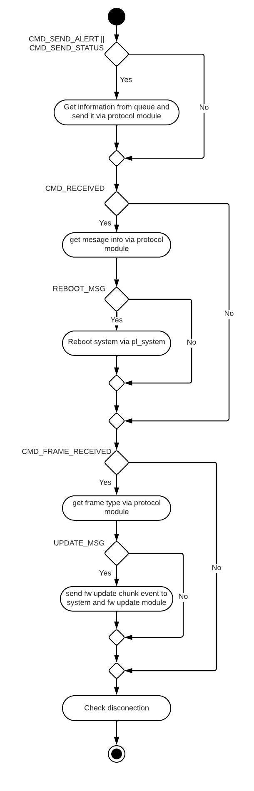

# cmd task

Aqui esta implemetanda el hilo que escucha a los comandos del servidor y ejecuta o da los eventos necesarios al sistema dependiendo del comando recibido. El hilo es independiente del protocolo de comunicación que se utilice, por lo que habra un modulo encargado de parsear y rellenar los bufferes de comunicación. El hilo utiliza el modulo a traves de interfaces.h. De la misma manera el hilo notifica eventos. Desconoce cuales son los modulos encargados de esas tareas, ya que podrian variar en el tiempo o ser distintos en distinto dispositivos.

   

## Configuración del hilo cmd task

El hilo energy es configurado utilizando al siguiente estructura:

~~~
typedef struct cmd_thread_config
{
	cmd_protocol_config_t*	cmd_protocol_config;
	pl_queue_t*				states_queue;
	pl_queue_t*				alets_queue;
	pl_event_t*				cmd_events;
	pl_event_t*				system_events;
	uint32_t				connected_event;
	uint32_t				fw_update_event;
	uint32_t				disconnected_event;
	pl_event_t*				sensor_event_groups[SENSOR_MAXVALUE];
	uint32_t				config_events[SENSOR_MAXVALUE];
	uint32_t				reset_events[SENSOR_MAXVALUE];
	uint32_t				start_events[SENSOR_MAXVALUE][SERVICE_MAXVALUE];
	uint32_t				stop_events[SENSOR_MAXVALUE][SERVICE_MAXVALUE];
	pl_event_t*				timesync_events;
	uint32_t				sync_event;
	pl_event_t*				fw_update_events;
	uint32_t				fw_file_chunk_received;
	uint32_t				fw_file_reception_finished;
	cmd_task_states_t*		sensor_to_task_state;
	event_info_t* 			event_info_array;
	bool					cmd_initialized;
}cmd_thread_config_t;
~~~

- **cmd_protocol_config**: Variable que le pasa el hilo cmd task al modulo encargado del protocolo, con su configuración especifica. El hilo desconoce el contenido de esta estructura ya que es especifico del protocolo que se este utilizando.
  
  En la documentacion del [protocolo](../protocol/README.md) se explica el contenido de esta estructura.
- **states_queue**: Queue donde recive el estado de los sensores y los servicios para mandarlos al servidor.
- **alets_queue**: Queue donde recive la informacion de alertas que ocurren en el sistema, para madar al servidor.
- **cmd_events**: Grupo de eventos al que espera el hilo para ejecutarse.
- **system_events**: Grupo de eventos utilizado para mandar eventos al sistema.
- **connected_event**: Evento que indica al sistema que se ha conectado con el servidor.
- **fw_update_event**: Evento que indica al sistema que va a recibir el FW de actualización.
- **disconnected_event**: Evento que indica al sistema que se ha desconectado con el servidor.
- **sensor_event_groups**: Array con los grupos de eventos de cada sensor del sistema.
- **config_events**: Array con tantas posiciones como sensores tiene el sistema. Cada posición está asignada a un sensor y contiene el evento que indica al sensor que se ha recibido su configuración. 
- **reset_events**: Array con tantas posiciones como sensores tiene el sistema. Cada posición está asignada a un sensor y contiene el evento que indica al sensor que se ha recibido un reset y tiene que borrar su configuración.
- **start_events**: Array con tantas posiciones como sensores tiene el sistema. Cada posición está asignada a un sensor y contiene otro array con los servicios de cada sensor, cada posición contiene el evento que indica al servicio del sensor que empiece a ejecutarese.
- **stop_events**: Array con tantas posiciones como sensores tiene el sistema. Cada posición está asignada a un sensor y contiene otro array con los servicios de cada sensor, cada posición contiene el evento que indica al servicio del sensor que pare de ejecutarese.
- **timesync_events**: Grupo de eventos para enviar eventos de sincronización de tiempo.
- **sync_event**: Evento para indicar al modulo encargado de la sincronización, que tiene que sincronizar el tiempo de nuevo.
- **fw_update_events**: Grupo de eventos para enviar eventos de FW update.
- **fw_file_chunk_received**: Evento para indicar al modulo encargado del fw update, que tiene disponible otro fragmento del nuevo FW.
- **fw_file_reception_finished**:  Evento para indicar al modulo encargado del fw update, que se ha resibido completamente el nuevo FW.
- **sensor_to_task_state**: Tabla que relaciona cada estado del sistema con uno de los estados del hilo.
- **event_info_array**: Array con las alertas y errores del hilo.
- **cmd_initialized**: Inicializarlo siempre a false. Indica si el hilo ha sido inicializado correctamente o no. De esta forma el hilo se ira a error en caso de ejecutarlo antes de inicializarlo.

## Estados del hilo cmd task

El hilo espera ha eventos para ejecutarse y dependiendo del estado en el que este el sistema, el hilo cmd task se ejecutara en un estado, y hara lo necesario dependiendo del evento recibido:

  

- **CMD_TASK_STATE_IDLE**:  El hilo no hace nada, solo atiende a eventos de dsconexion, para poder avisar al sistema que ya no esta conectado con el servidor.

 

- **CMD_TASK_STATE_CONNECT**: El hilo espera a resibir el evento para conectarse, una vez hecho esto se conecta al servidor a traves del modulo del protocol. Si no lo consigue inicia un timer para reintentarlo cuando el timer expire.
  
- **CMD_TASK_STATE_NORMAL**: En estado normal, el hilo espera a eventos de comando recibido, de transmisión, de desconexión y de fragmentos recibido.
  
  En el caso de comando recibido, se analizar el comando a traves del modulo de protocol y dependiendo del comando recivido ejecutara unas acciones u otras.
  
  La transmisión se diferencia en mandar que el sistema esta online, mandar alertas, o mandar status. 
  
 
  
- **CMD_TASK_STATE_FW_UPDATE**: En este estado el hilo atiende a fragmentos de fw update recibidos y va notificando al sistema de que hay nuevos datos disponibles. También atiende al evento de comando recibido, para saber cuando ha termiando de recibir el nuevo FW y notificarlo con un evento al modulo encargado de la actualización.
  
  Adicionalmente, como en casi todos los estados, tambien comprueba que no se haya perdido conexión con el servidor.

 
  
- **CMD_TASK_STATE_ERROR**: Depende del error que tenga el sistema, puede que no se puede comunicar, aun así intentara hacer varias cosas en esete estados. Da la posibilidad de transmitir alertas y status para poder informar al servidor del error, atiende comandos de reboot y de FW updata, y comprueba que no se haya perdido conexión con el servidor.

 

