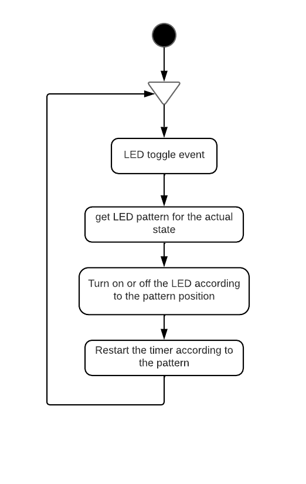

# LED handler task

 Hilo encargado de manejar el LED de estado del dispositivo.

   

El hilo es configurado utilizando al siguiente estructura:

~~~
typedef struct led_thread_config
{
    uint8_t			led_gpio_user_index;
	uint8_t			led_gpio_user_enable_index;
	led_pattern_t*	pattern_table;
	bool			led_handler_initialized;
}led_thread_config_t;
~~~

- **led_gpio_user_index**: Index de la configuración del user gpio en pl_hw_confg.h de pl_gpio.
- **led_gpio_user_enable_index**: Index de la configuración del user enable gpio en pl_hw_confg.h de pl_gpio.
- **pattern_table**: Tabla de patrones utilizados por el hilo. El array deberia tener tantas posiciones como estados, cada posición tiene el patron de parpadeo que corresponde a ese estado. La estructura del patron es la siguiente: 
  *  toggle_state_table: Arrai con tantas posiciones como estados tiene el LED en un ciclo. Este es el contenido del cada estado:
     * led_state: Sus valores son LED_ON o LED_OFF.El LED debera estar asi todo el tiempo que dure este estado,
     * state_time_ms: Duración del estado en ms.
  *  toggle_amount: Indica cuantas posiciones hay en el arrau de toggle_state_table;
  *  pattern_position: Indica en que posición se encuentra actualmente.  

	Estas son las estructuras que componen pattern_table:
~~~
typedef struct led_patternt
{
	toggle_state_t* 	toggle_state_table;
	uint32_t 			toggle_amount;
	uint32_t 			pattern_position;
}led_pattern_t;

typedef struct toggle_state
{
	led_state_t led_state;
	uint32_t	state_time_ms;
}toggle_state_t;
~~~

- **led_handler_initialized**: Inicializarlo siempre a false. Indica si el hilo ha sido inicializado correctamente o no. De esta forma el hilo se ira a error en caso de ejecutarlo antes de inicializarlo.

## Funcionamiento

El hilo espera a eventons de toggle de LED. Cuando recive un evento se ejecuta y obtiene el patron de parpadeo correspondiente al estado actual del sistema. Una vez obtenido incremeta la posición actual del patron, y enciende o apaga el LED dependiendo lo que diga el patron. Una vez hecho esto se ejecuta el timer con el tiempo que indica el patron que tiene que estar el LED en este estado, y vuelve a esperar al evento. Cuando el timer expire mandara el evento para que el hilo vuelva a ejecutarse.

  
