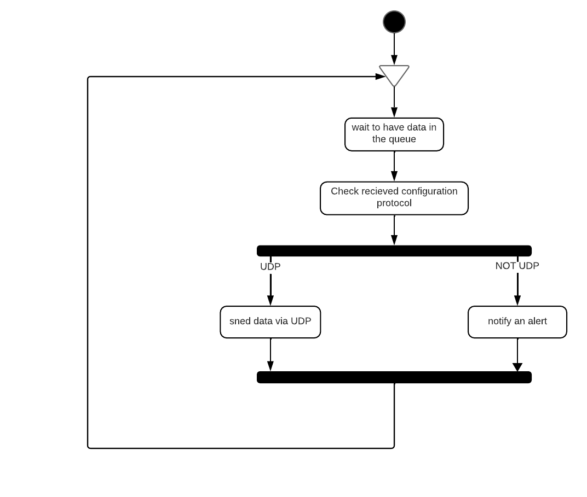

# Streaming task

 Hilo encargado de enviar por el protcolo configurado, de mometo solo UDP, los datos recibidos en la queue. El hilo notifica las alertas detectas via interfaces.h. Desconoce como se genstionan las alertas y cual es el modulo encargado de hacerlo, y podria variar en el tiempo o ser distintos en distinto dispositivos, por eso accede a el a traves de interfaces.h.

   

El hilo es configurado utilizando al siguiente estructura:

~~~
typedef struct streaming_thread_config
{
	uint32_t	 	stream_socket_index;
	pl_queue_t*		stream_task_queue;
	event_info_t* 	event_info_array;
	bool			stream_initialized;
}streaming_thread_config_t;

~~~

- **stream_socket_index**: Index de la configuración en pl_hw_confg.h de pl_socket.
- **stream_task_queue**: Queue donde recibe la configuración de la transmisión y los datos a transmitir.
- **event_info_array**: Array con las alertas y errores del hilo. 
- **stream_initialized**: Inicializarlo siempre a false. Indica si el hilo ha sido inicializado correctamente o no. De esta forma el hilo se ira a error en caso de ejecutarlo antes de inicializarlo.

## Funcionamiento

El hilo se queda esperando a tener algo en la queue. Cuando algo que mandar, mira la información de transmision y manda por el protocolo configurado (En estos momentos solo esta implementado para UDP).

  
