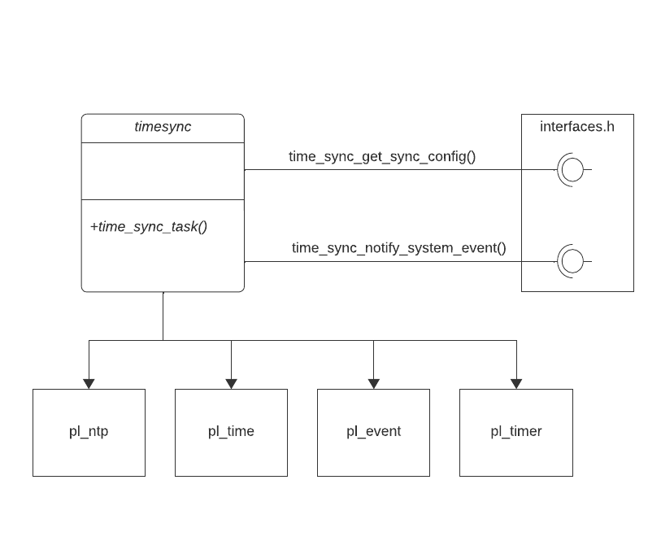

# Timesync task

 Hilo encargado de sincronizar por NTP el reloj del sistema. Lo hace de manera puntual o periodica, en el caso de necesitar sicnronización periodica obtendra la frecuencia de un modulo externo desconocido a traves de interfaces.h. Además de esto, notifica las alertas detectas via interfaces.h. Desconoce como se genstionan las alertas y cual es el modulo encargado de hacerlo, y además, podria variar en el tiempo o ser distintos en distinto dispositivos, por eso accede a el a traves de interfaces.h.

   

El hilo es configurado utilizando al siguiente estructura:

~~~
typedef struct time_sync_thread_config
{
	uint8_t			tyme_sync_ntp_index;
	pl_event_t*		time_sync_events;
	pl_event_t*		system_events;
	uint32_t		sync_process_finished;
	event_info_t* 	event_info_array;
	bool			time_sync_initialized;
}time_sync_thread_config_t;
~~~

- **tyme_sync_ntp_index**: Index de la configuración en pl_hw_confg.h de pl_socket.
- **time_sync_events**: Grupo de eventos al que espera el hilo para ejecutarse.
- **system_events**: Grupo de eventos utilizado para mandar eventos al sistema.
- **sync_process_finished**: Evento para indicar al sistema que se ha terminado la sincronizción.
- **event_info_array**: Array con las alertas y errores del hilo. 
- **stream_initialized**: Inicializarlo siempre a false. Indica si el hilo ha sido inicializado correctamente o no. De esta forma el hilo se ira a error en caso de ejecutarlo antes de inicializarlo.

## Funcionamiento

El hilo se queda esperando a que llegue un evento de sincronización. En ese momento sincronizará el reloj del sistema con la hora recivida por NTP. Si el evento era para una sincronización que viene de un comando externo, puede estar configurado para que sea una configuración periodica, en ese caso se ejecutara un timer con el tiempo de periodo recibido. Cuando el timer expira señaliza un evento de sincronización puntual y vuelve a ejecutar el timer.

  
